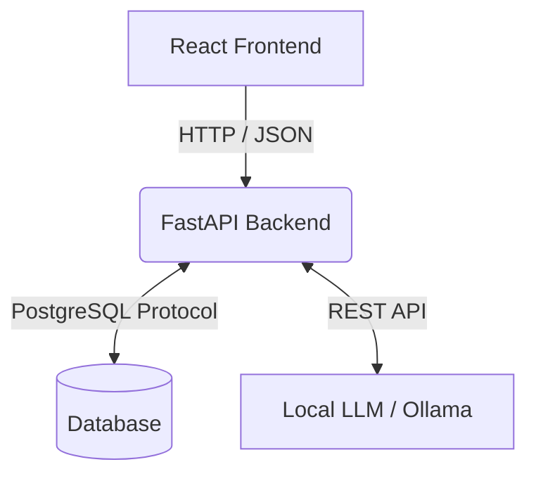

# 🏗 Architecture Overview

This document explains the technical foundation of **NivexQL**. The goal of this architecture is to provide an ultra-responsive, privacy-first, desktop-class experience using modern web technologies.

## High-Level System Design

NivexQL operates on a decoupled Client-Server architecture:
1. **Frontend (Client)**: A React 19 + Vite single-page application built to run seamlessly inside Electron or a standard Web Browser.
2. **Backend (Server)**: A stateless FastAPI Python server that acts as the bridge between the UI, the Database, and the LLM.

## The Stateless Philosophy

Security and privacy are paramount. **The backend stores absolutely no state.**
- There is no application database (no SQLite, no Postgres for the app itself).
- Connection strings, credentials, query histories, and global context are stored entirely in the Frontend's memory (using `Zustand`).
- Every request from the frontend to the backend contains *everything* the backend needs to execute the task (the connection string, the schema, the prompt, and the context).

## 1. The Frontend (React + Zustand)

- **State Management**: We use `zustand` to manage a global application state (`useAppStore.ts`). This store acts as the single source of truth for all Notebook cells, active database connections, and UI preferences.
- **The Notebook Pattern**: The UI mimics Jupyter Notebooks. The state is an array of `NotebookCell` objects. When users drag-and-drop cells, we modify the array order in the Zustand store, and React effortlessly handles the DOM reconciliation.
- **Code Editor**: Integrated `@monaco-editor/react` provides VS Code-level syntax highlighting and formatting.
- **Visualizations**: Raw data is pumped into custom `D3.js` components (`D3Chart.tsx`) which dynamically calculate axes and scales based on the returned data types.

## 2. The Backend (FastAPI + LangChain)

The backend exposes several endpoints under `/api`:
- `POST /api/databases/connect`: Validates credentials via `sqlalchemy`.
- `POST /api/databases/schema`: Uses SQLAlchemy reflection to extract tables, columns, and data types.
- `POST /api/query`: Executes raw SQL and returns formatted rows/columns.
- `POST /api/ai/generate`: The core agent logic.

### The Agentic Execution Loop
When a user asks for SQL via natural language, the backend follows an Agentic loop:
1. **Prompt Construction**: The backend combines the user's prompt, the full database schema, and the user's custom `global_context`.
2. **LLM Generation**: The prompt is sent to the local LLM (via Ollama or an API). The LLM is instructed to return *only* valid SQL.
3. **Execution**: The generated SQL is executed immediately against the database.
4. **Error Catching (The "Agent" part)**: If the database throws an error (e.g., syntax error, column does not exist), the backend intercepts it. It then sends a *new* prompt to the LLM containing the failed SQL and the exact database error message, asking for a fix.

## Security Considerations
Because this tool executes raw SQL strings generated by an AI, it is **highly recommended** that users connect to their databases using Read-Only credentials. The backend does not implement SQL parsing to block `DROP` or `UPDATE` commands—it relies entirely on database-level permissions.
